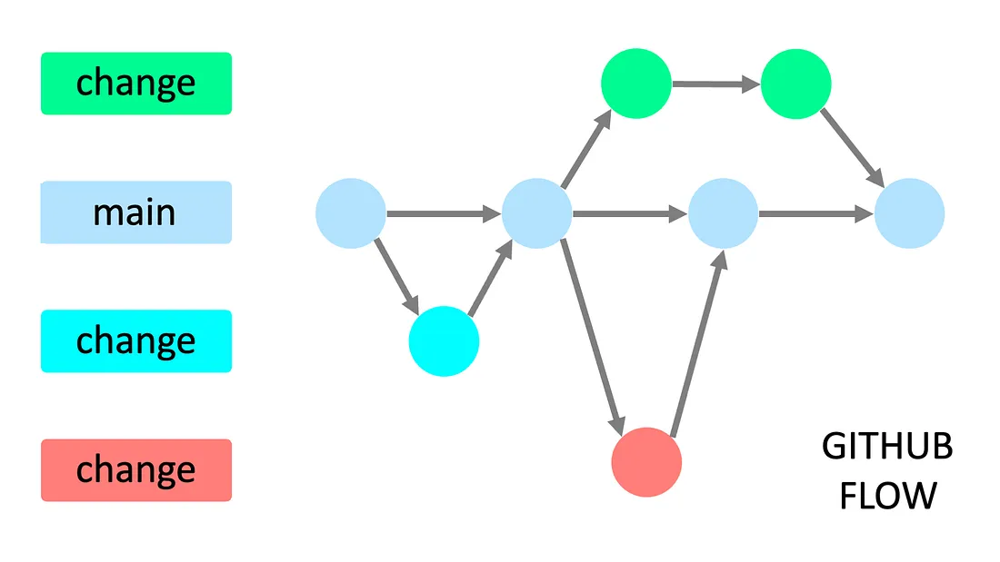
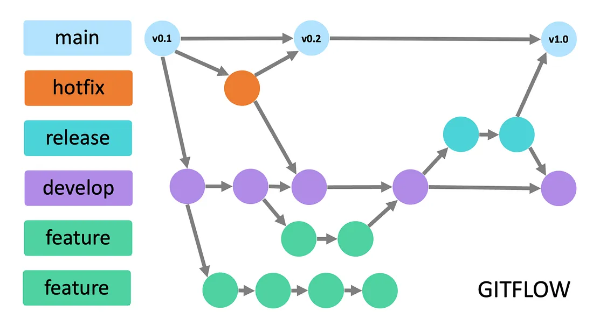

## 🟡 Nível Intermediário: Colaboração

### 🔀 Branches:

- Criar branch 
```bash
git checkout -b nova_branch
```
- Alternar branches
```bash
git checkout main
```
- Deletar branch local
```bash
git branch -d nova_branch
```
- Deletar branch remota
```bash
git push origin -d nova_branch
```
- Mesclar branches
```bash
git merge nova_branch main
```
- Resolver conflitos

### 👥 Colaboração:

- Forks e Pull Requests (PR)
- Code review
- Issues e discussions
- GitHub Projects (Quadros Kanban e outros)

### 📁 Boas práticas:

- Commits atômicos e bem descritos
- Branches com nomes claros
- Fluxo Git (GitHub Flow e Git Flow)

---

#### **GitHub Flow**

O GitHub Flow é um fluxo de trabalho leve e direto, projetado para ser fácil de entender e implementar. Ele gira em torno do conceito de branches e pull requests, tornando-o ideal para equipes que trabalham com integração contínua e implantações frequentes.



---

> Pontos-chave a considerar no GitHub Flow

- **Branch Main**: O branch main é sempre implantável e representa a versão estável mais recente do código.
- **Branches de Feature**: Os desenvolvedores criam branches de feature para cada novo recurso ou correção de bug sempre que novas alterações são necessárias. Esses branches são isolados do branch master até que estejam prontos para revisão.
- **Pull Requests**: Após concluir o trabalho em um branch de feature, os desenvolvedores abrem pull requests para iniciar a revisão e a discussão do código.
- **Deploy Contínuo**: Após a aprovação de um pull request, as alterações são mescladas no branch master e implantadas automaticamente na produção.

> Importância do GitHub Flow

- **Simplicidade**: O GitHub Flow é fácil de aprender e implementar, tornando-o adequado para equipes de pequeno e médio porte.
- **Feedback mais rápido**: Ao usar pull requests, os desenvolvedores recebem feedback sobre seu código antes de mergulhá-lo na branch principal.
- **Integração contínua**: A mesclagem frequente com a branch principal garante que a base de código esteja sempre atualizada e pronta para implantação.

---

#### **Git Flow**

O Git Flow é um modelo de ramificação mais complexo que oferece uma abordagem estruturada para gerenciar grandes projetos com lançamentos agendados. Ele apresenta duas ramificações de longa duração — develop e main — juntamente com várias ramificações de suporte.



---

> Pontos-chave a considerar no Git Flow

- **Main**: Ramificação principal da produção
- **Hotfix**: Ramificações de hotfix são usadas para resolver rapidamente problemas críticos na base de código de produção. Elas são criadas a partir da ramificação mestre.
- **Release**: Quando um conjunto de recursos está pronto para lançamento, uma ramificação de lançamento é criada a partir da ramificação de desenvolvimento para testes finais e correções de bugs.
- **Develop**: O branch de desenvolvimento serve como branch de integração para recursos, contendo código em andamento.
- **Feature**: Os desenvolvedores criam ramificações de recursos a partir da ramificação de desenvolvimento para trabalhar em novos recursos ou correções de bugs.

> Importância do Git Flow

- **Desenvolvimento Estruturado**: O Git Flow fornece uma estrutura clara para gerenciar o desenvolvimento de funcionalidades, lançamentos e correções.
- **Fluxos de Trabalho Paralelos**: Diferentes equipes podem trabalhar simultaneamente em branches de funcionalidades separadas, promovendo o desenvolvimento paralelo.
- **Master Estável**: A branch main permanece estável e serve como uma base confiável para lançamentos de produção.

---

### 🤔 Github Flow ou Git Flow?

Escolher o fluxo de trabalho de controle de versão correto é crucial para um processo de desenvolvimento bem-sucedido. O <b style='color:rgb(253, 85, 7)'>GitHub Flow** é adequado para projetos com implantações frequentes e equipes pequenas</b>, enfatizando a simplicidade e a integração contínua. Por outro lado, o <b style='color:rgb(26, 253, 147)'>Git Flow oferece uma abordagem estruturada, tornando-o ideal para projetos maiores com lançamentos agendados e múltiplas equipes de desenvolvimento</b>.

Ao entender as diferenças entre o GitHub Flow e o Git Flow, você pode tomar uma decisão informada sobre qual fluxo de trabalho melhor se alinha aos requisitos da sua equipe e à escala do projeto. Independentemente de você optar pela flexibilidade do GitHub Flow ou pela abordagem estruturada do Git Flow, ambos os fluxos de trabalho contribuem para uma colaboração eficaz e práticas de desenvolvimento otimizadas.

---

### 🏠 Atividade

-   Envia alterações com uma nova branch através de Pull Request (PR) no VS Code
-   Envia alterações com uma nova branch através de Pull Request (PR) no Github 